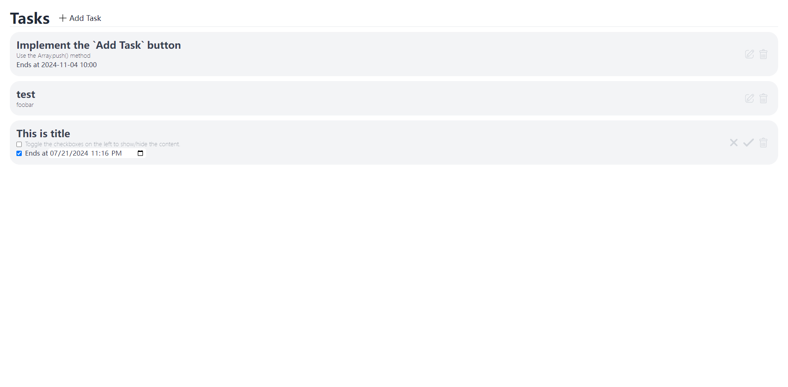

## Description

A very simple project using vue.js, tailwind and express.js, and it operates the database using mysql.



## Requirements

This project needs [node.js](https://nodejs.org/) installed.

## How to run

```sh
# go to the project directory
cd server
npm install
npm start
```

Then start a new shell, go to the project directory and run:
```sh
cd client
npm install
npm run dev
```

You can now open the link in this terminal. If you are running this project for the first time, you will see a page with nothing except the title `Task` and the button `+ Add Task`

## How to stop
In the console running the vue.js dev server, input `q` and press `Enter` to stop it;
In the console running the express.js server, press `Control`+`C` to stop it.
