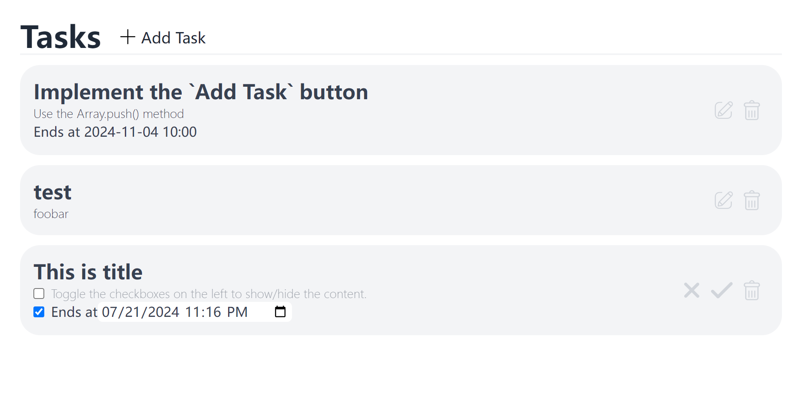

## Description

A very simple project using vue.js, tailwind and express.js. And it operates the database using mysql.



## Requirements

This project needs [MySQL]("https://www.mysql.com/") and [node.js](https://nodejs.org/) installed.

## How to run

```sh
# go to the project directory
cd server
npm install
```

Replace `YOUR_MYSQL_PASSWORD` to your MySQL root password in the following command.

On Windows Powershell, run:

```sh
$env:MYSQL_PASSWORD='YOUR_MYSQL_PASSWORD'
```

On MacOS or Linux, run:

```sh
export MYSQL_PASSWORD="YOUR_MYSQL_PASSWORD"
```

Then, on both operating systems, run:

```sh
npm start
```

Then open a new terminal window, go to the project directory and run:
```sh
cd client
npm install
npm run dev
```

You can now open the link in this terminal. If you are running this project for the first time, you will see a page with nothing except the title `Task` and the button <button>+ Add Task</button>
